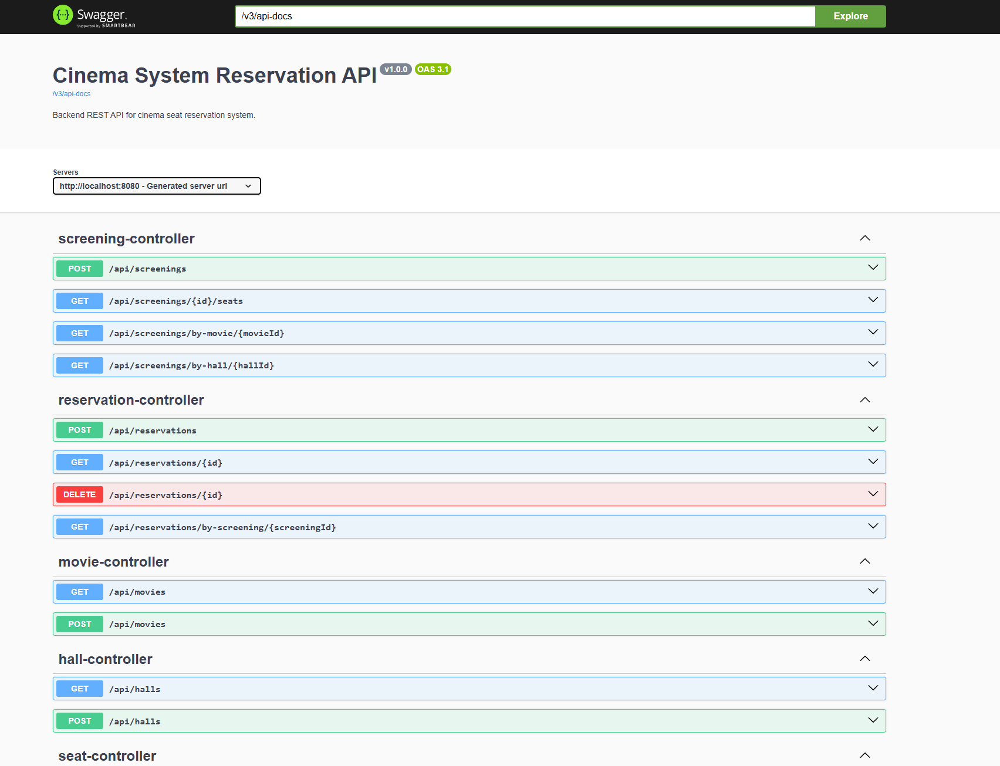

# 🎬 Cinema System Reservation API

A robust RESTful API backend for managing a cinema seat reservation system. Built with **Java 21** and **Spring Boot 3.4**, utilizing **PostgreSQL** for data persistence, **Docker** for environment management, and **Testcontainers** for reliable integration testing.

## 🚀 Key Features

* **Smart Seat Reservation:** Reserve specific seats for a given screening. The system prevents double-booking using database-level constraints (`UniqueConstraints`).
* **Real-time Seat Map:** Fetch the real-time availability status (free/reserved) of all seats for a specific screening, optimized for frontend rendering.
* **Complex Business Logic:** Validates overlapping screenings in the same hall and prevents canceling or booking tickets 15 minutes before the movie starts.
* **Global Exception Handling:** Standardized, client-friendly JSON error responses using `@RestControllerAdvice`.
* **Secrets Management:** Secure database credentials handling using Spring Profiles and Docker `.env` files.

## 🛠️ Tech Stack

* **Language:** Java 21 (utilizing Records for DTOs)
* **Framework:** Spring Boot 3.4 (Web, Data JPA, Validation)
* **Database:** PostgreSQL 16
* **Containerization:** Docker & Docker Compose
* **Testing:** JUnit 5, MockMvc, Testcontainers
* **Documentation:** Swagger / OpenAPI (Springdoc)
* **Build Tool:** Maven

## 🐳 Running Locally

### Prerequisites
Make sure you have **Java 21**, **Maven**, and **Docker Desktop** installed on your machine.

### 1. Environment Setup
The project uses environment variables to secure database credentials.

1. Copy the example environment file:
   ```bash
   cp .env.example .env
   ```
2. Open the `.env` file and set your desired database credentials.
3. In `src/main/resources/`, create a file named `application-config.properties` and add your database credentials to match the `.env` file:
   ```properties
   spring.datasource.url=jdbc:postgresql://localhost:5433/cinema_db
   spring.datasource.username=your_user
   spring.datasource.password=your_password
   ```

### 2. Start the Database 
Spin up the local PostgreSQL instance using Docker Compose:
   ```bash
   docker compose up -d
   ```

### 3. Run the Application
Start the Spring Boot application with the `config` profile:
   ```bash
   mvn spring-boot:run -Dspring-boot.run.profiles=config
   ```
The application will start on `http://localhost:8080`.

## 📚 API Documentation (Swagger UI)

Once the application is running, you can interact with the API directly from your browser.
Open the following URL to access the Swagger UI:

👉 **[http://localhost:8080/swagger-ui.html](http://localhost:8080/swagger-ui.html)**



## 🧪 Testing

The project is heavily tested using **Testcontainers**. When you run the tests, a temporary, isolated PostgreSQL Docker container is spun up automatically. This ensures the integration tests run against a real database environment (handling native PostgreSQL dialects and constraints) without any manual setup.

To run the tests:
   ```bash
   mvn test
   ```

## 📐 Database Schema Overview

* **movies** - Stores movie details (title, duration).
* **halls** - Stores cinema hall information.
* **seats** - Stores layout (row and number) tied to a specific hall.
* **screenings** - Links a movie and a hall to a specific start time.
* **reservations** - Stores customer reservation details.
* **reserved_seats** - Join table linking a reservation, a screening, and specific seats.
