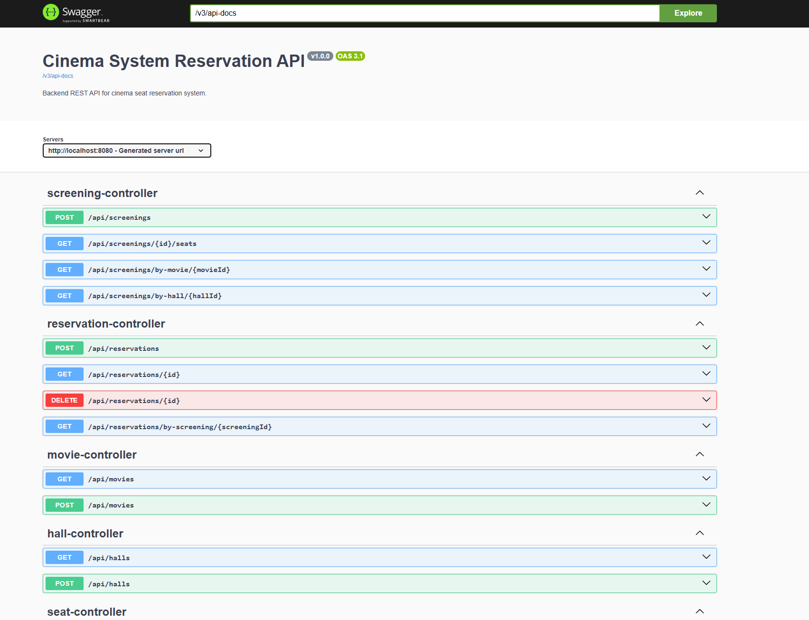

# 🎬 Cinema System Reservation API

A RESTful backend for a cinema seat reservation system. Built with **Java 21** and **Spring Boot 3.4**, using **PostgreSQL** for persistence, **Docker** for the local environment, and **Testcontainers** for integration tests that run against a real database.

## 🚀 Key Features

* **Seat Reservation:** Reserve specific seats for a given screening.
* **Concurrency-safe:** Double-booking is prevented under concurrent load. Verified by a multi-threaded integration test against a real PostgreSQL instance: competing threads pass the availability check simultaneously, and the database unique constraint rejects the second write, which is mapped to `409 Conflict`.
* **Real-time Seat Map:** Fetch the availability status (free/reserved) of all seats for a screening, shaped for frontend rendering.
* **Business Rules:** Rejects overlapping screenings in the same hall; blocks booking and cancellation within 15 minutes of the start time.
* **Global Exception Handling:** Standardized JSON error responses via `@RestControllerAdvice`.
* **Fail-fast Configuration:** Database credentials come from environment variables. The application refuses to start when they are missing, so it can never run against unintended credentials.

## 🛠️ Tech Stack

* **Language:** Java 21 (records used for DTOs)
* **Framework:** Spring Boot 3.4 (Web, Data JPA, Validation)
* **Database:** PostgreSQL 16
* **Containerization:** Docker & Docker Compose
* **Testing:** JUnit 5, Mockito, MockMvc, Testcontainers
* **CI:** GitHub Actions — builds the application and runs 39 tests on every push
* **Coverage:** JaCoCo
* **Documentation:** Swagger / OpenAPI (Springdoc)
* **Build Tool:** Maven

## 🐳 Running Locally

### Prerequisites

**Java 21** and **Docker Desktop**.

Maven is not required — the project ships the Maven Wrapper (`mvnw`), which downloads the
correct Maven version on first use.

### 1. Environment setup

Copy the example environment file and set your own values:

```bash
cp .env.example .env          # Windows: copy .env.example .env
```

Docker Compose reads this file automatically when creating the database container.
The application reads the same values from environment variables.

Only `DB_USER` and `DB_PASSWORD` are required — host, port and database name fall back
to sensible defaults.

### 2. Start the database

```bash
docker compose up -d
```

### 3. Run the application

Pass the credentials as environment variables:

```bash
# Linux / macOS
DB_USER=cinema_user DB_PASSWORD=cinema_password ./mvnw spring-boot:run
```

```powershell
# Windows PowerShell
$env:DB_USER="cinema_user"
$env:DB_PASSWORD="cinema_password"
.\mvnw.cmd spring-boot:run
```

In IntelliJ IDEA: **Run → Edit Configurations → Environment variables**.

The application starts on `http://localhost:8080`.

## 🧪 Testing

```bash
./mvnw verify          # Windows: .\mvnw.cmd verify
```

This compiles the project, runs the full test suite and packages the application — the
same command the CI pipeline executes.

The suite covers three levels:

* **Unit tests** — service logic in isolation, collaborators replaced with Mockito mocks.
* **Web layer tests** — controllers via `@WebMvcTest` and `MockMvc`, verifying routing,
  serialization and HTTP status codes.
* **Integration tests** — full Spring context against a real PostgreSQL container started
  by Testcontainers, including a concurrency test that runs competing reservations in
  parallel threads.

No manual database setup is needed for tests: Testcontainers starts and disposes of the
container automatically.

## 📐 Design Notes

**Two layers of protection against double-booking.** The service first checks seat
availability, which handles the common case with a clear error message. That check is not
atomic, however — under concurrent load two requests can pass it at the same time. The
actual guarantee is a unique constraint on `(screening_id, seat_id)`; the losing write
fails with a constraint violation, which is caught and translated into `409 Conflict`.
The service check exists for user experience, the constraint for correctness.

**DTOs separated from entities.** Requests and responses use dedicated records, so the
persistence model can evolve without changing the public API contract.

**Lazy associations.** Entity relations use `FetchType.LAZY` and are mapped to DTOs inside
the transactional boundary, keeping response payloads explicit rather than accidental.

## 📚 API Documentation (Swagger UI)

With the application running, open:

👉 **[http://localhost:8080/swagger-ui.html](http://localhost:8080/swagger-ui.html)**



## 🗄️ Database Schema Overview

| Table | Contents |
|---|---|
| `movies` | Movie details (title, duration) |
| `halls` | Cinema hall information |
| `seats` | Seat layout (row, number) tied to a hall |
| `screenings` | A movie and a hall at a specific start time |
| `reservations` | Customer reservation details |
| `reserved_seats` | Join table linking a reservation, a screening and a seat; carries the unique constraint preventing double-booking |
